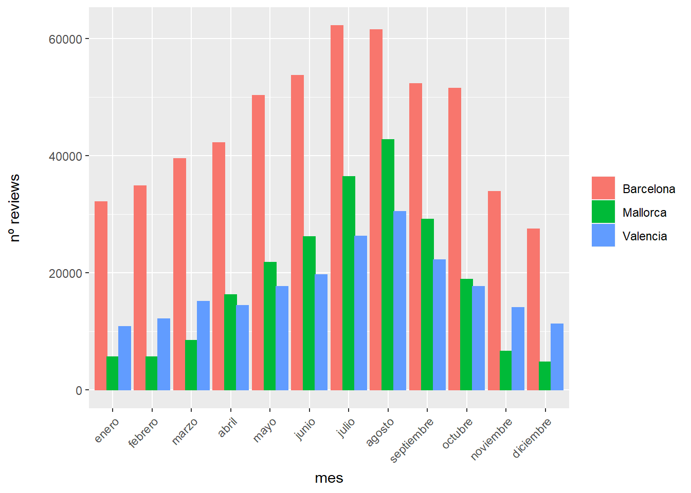
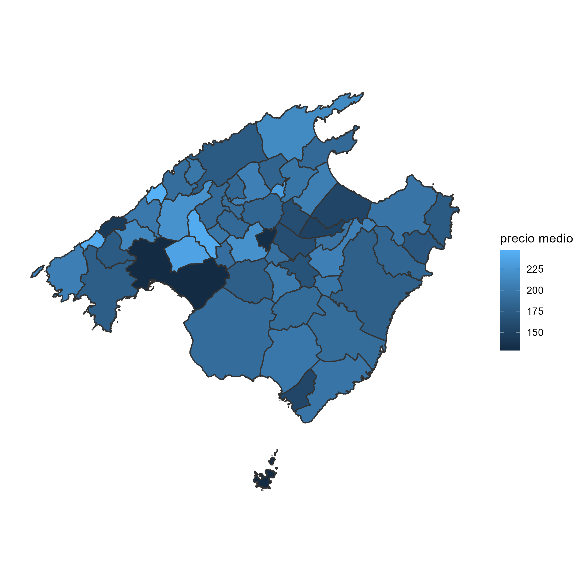

```{r setup, include=FALSE}
knitr::opts_chunk$set(eval=F,echo = TRUE,warning=F, fig.align='center', out.height="70%", out.width="70%",dev.args = list(png = list(type = "cairo")),comment = NA)

library(tidyverse)
library(ggpubr)
library(lubridate)
library(feather)
library(knitr)
library(kableExtra)
```

<div style="text-align: justify">  

#  Introducción

En el presente trabajo se busca realizar el análisis exploratorio de los datos relativos a alquileres vacacionales publicados en la página de <a href=" http://insideairbnb.com/get-the-data.html"> Airbnb </a> para el periodo octubre 2021 - octubre 2022 en Barcelona, Mallorca, y Valencia.

El mismo se estructura de la siguiente forma: 


1. Introducción.
2. Lectura y limpieza de los datos. 
3. Análisis exploratorio.
4. Gráfico interactivo.


El *dataset* consta de tres archivos por zona: *calendar*, *listing*, y *reviews*. En el caso de Barcelona y Valencia, los datos se corresponden con los apartamentos disponibles en el área de la ciudad desagregado por barrios, mientras que en el caso de Mallorca, los mismos se encuentran agrupados por municipios.

El archivo *calendar* contiene 7 variables, que reflejan los apartamentos (disponibles o no), clasificados por fecha. Allí mismo se detalla el precio, y la cantidad mínima y máxima de noches en las que es posible hospedarse.

El archivo *listing* posee 74 variables, de las cuales hemos hecho una selección que se detalla más adelante. En el mismo se encuentra la siguiente información de los apartamentos: su *url*, descripción, foto, ubicación, información del anfitrión y métricas vinculadas a las características del apartamento, al equipamiento, su disponibilidad, y a las reviews. 

El archivo *reviews* contiene 6 variables relativas a cada apartamento. Allí podemos encontrar información detallada por fecha y apartamento de las reviews, en las que se identifica al huésped y el comentario que ha dejado.

# Lectura de datos y limpieza

A continuación se realiza la carga de los archivos *calendar* y *listing*:

```{r}
Vcalendar=read.csv("data/Valencia/calendar.csv")
Vlisting=read.csv("data/Valencia/listings.csv")


Mcalendar=read.csv("data/Mallorca/calendar.csv")
Mlisting=read.csv("data/Mallorca/listings.csv")


Bcalendar=read.csv("data/Barcelona/calendar.csv")
Blisting=read.csv("data/Barcelona/listings.csv")
```

## Filtrado de los datos

De ambos archivos hemos decicido seleccionar las siguientes columnas, que serán luego utilizadas para el análisis exploratorio de los datos. Hemos detallado el tipo de variable encontrada en cada caso:

* *Listings* : id,neighbourhood_cleansed,latitude,longitude, bedrooms, beds, price
                id: identificación unívoca del apartamento (integer), neighbourhood_cleansed: barrio (character), latitude: latitud (numeric), longitude: longitud (numeric), bedrooms: número de habitaciones (integer), beds: número de camas (integer), price: precio (character)

* *Calendar*: listing_id, date, price.
                listing_id: identificación unívoca del apartamento (integer) , date: fecha (character), price: precio (character).

Hemos procedido luego a convertir las variables *price* de formato character a numeric, de modo de poder operar con las mismas. De la misma manera, la variable *date* ha sido ajustada de character a formato fecha. Para ellos utilizamos las funciones *parse* y *mutate*.
Por último, hemos quitado todas las filas con precio=*NA* mediante la función *filter*.


```{r}
listingfilter = function(listing){
listing2=listing %>% select(id,neighbourhood_cleansed,
                              latitude,longitude, bedrooms, beds, price) %>%
  filter( !is.na(price)) %>%
  mutate(price=parse_number(price)) 
return(listing2)}

calendarfilter = function(calendar){
calendar2= calendar %>% 
  select(listing_id ,date, price) %>%
  filter(!is.na(price)) %>%
  mutate(price=parse_number(price), date=parse_date(date,format= "%Y-%m-%d"))
return(calendar2)}
```

Aplicamos las funciones a cada zona:

```{r}
Vlisting2 = listingfilter(Vlisting)  %>%
  mutate(zona="Valencia")

Vcalendar2 = calendarfilter(Vcalendar)

Mlisting2 = listingfilter(Mlisting) %>%
  mutate(zona="Mallorca")

Mcalendar2 = calendarfilter(Mcalendar)

Blisting2 = listingfilter(Blisting) %>%
  mutate(zona= "Barcelona")
Bcalendar2 = calendarfilter(Bcalendar)
```

Para condensar toda la información en un mismo *data frame*, unimos los *listings* a los *calendars* a partir de la función *left_join* y  mediante el *id* de cada alquiler (*listing_id* en los calendar). 

Además, añadimos una nueva columna con la zona a la que pertenece cada fila.

```{r}
Vcalendar3 = Vcalendar2 %>% 
  rename(id=listing_id) %>%
  left_join(Vlisting2,by="id") %>%
  rename( price= price.x) %>%
  mutate(zona= "Valencia")

Mcalendar3 = Mcalendar2 %>% 
  rename(id=listing_id) %>%
  left_join(Mlisting2,by="id") %>%
  rename( price= price.x) %>%
  mutate(zona= "Mallorca")

Bcalendar3 = Bcalendar2 %>% 
  rename(id=listing_id) %>%
  left_join(Blisting2,by="id") %>%
  rename( price= price.x) %>%
  mutate(zona= "Barcelona")
```

Unimos los tres *calendars* en un único *data frame* y lo guardamos en un archivo local,

```{r}
calendar_global= rbind(rbind(Vcalendar3,Mcalendar3), Bcalendar3)
listing_global=rbind(rbind(Vlisting2 ,Mlisting2), Blisting2)

write_feather(calendar_global,path = "data/calendar_global.feather" )
write_feather(listing_global,path = "data/listing_global.feather" )
```

Liberamos la memoria y cargamos el archivo.

```{r}
rm(list=ls())
```

```{r}
calendar_global=read_feather("data/calendar_global.feather" )
```

## Tratamiento de valores atípicos

Realizamos un gráfico de histograma por zona, mediante el cual se pone de manifiesto la existencia de valores atípicos, que representan apartamentos de precio elevado.

```{r}
calendar_global %>%
  ggplot(aes(x=price, color=zona, fill=zona)) + 
  geom_histogram(bins=30) +
  facet_grid(~zona) +
  theme(axis.text.x=element_text(angle=45, hjust=1)) +
  labs(x= "Precio (€)", y= "Frecuencia") +
  theme(legend.position =  "None", 
        axis.title.y = element_text(margin = margin(t = 0, r = 20, b = 0, l = 0)),
        axis.title.x = element_text(margin = margin(t =20 , r = 0, b = 0, l = 0)))

ggsave("outliers.png", dpi=100, scale = 0.5)
```
<center>
<figure>
  
  <figcaption>Fig.1: Histograma de los precios de las tres ciudades.</figcaption>
</figure>
</center>
<p>

</p>

Para un correcto análisis de la información, procedemos a reemplazar por *NA* los valores que se encuentren a 1.5 veces por encima y por debajo del rango intercuantílico en los archivos *calendar* y *listing* para la variable *price*. De igual modo, a los apartamentos que no tengan valor asignado en las variables camas y habitaciones, los reemplazamos por *NA*, ya que no es posible tener un apartamento de dichas características.

```{r}
outlier_out_cal= function(data){
  Q= data$price %>% quantile(probs=c(0.25,0.75), na.rm=T)
  iqr=IQR (data$price , na.rm=T)
  data_new= data %>%  mutate(price= ifelse(price< Q[1] - 1.5*iqr | price>Q[2] + 1.5*iqr | price==0  ,NA, price)) 
  return(data_new)}

outlier_out_list= function(data){
  Q= data$price %>% quantile(probs=c(0.25,0.75), na.rm=T)
  iqr=IQR (data$price , na.rm=T)
  data_new= data %>%      mutate(
    price= ifelse(price< Q[1] - 1.5*iqr | price>Q[2] + 1.5*iqr |   price==0,NA, price),      
    beds= ifelse(beds== 0, NA, beds), 
    bedrooms =ifelse(bedrooms==0 ,NA, bedrooms))  
  return(data_new)}
```

Aplicamos las funciones a cada zona:

```{r}
Valencia=calendar_global %>%
  filter(zona=="Valencia") %>%
  outlier_out_cal()

Mallorca=calendar_global %>%
  filter(zona=="Mallorca") %>%
  outlier_out_cal()

Barcelona=calendar_global %>%
  filter(zona=="Barcelona") %>%
  outlier_out_cal()

```

Nuevamente unificamos los dataframes con los outliers tratados y guardamos los datos en archivos locales para liberar espacio de la memoria: 

```{r}
calendar_global2= rbind(rbind(Valencia, Mallorca), Barcelona)
```


Guardamos los datos nuevamente en archivos locales:

```{r}
write_feather(calendar_global2, path = "data/calendar_global2.feather")
```

Liberamos memoria y cargamos el archivo:

```{r}
rm(list=ls())
```
```{r, eval=T}
calendar_global= read_feather("data/calendar_global2.feather")
```

Representamos un histograma de los precios por ciudad:

```{r}

calendar_global %>%
  ggplot(aes(x=price, color=zona, fill=zona)) +
  geom_histogram(bins = 20, na.rm=T) +
  labs(x= "Precio (€)", y= "Frecuencia") +
  facet_grid(~zona ) +
  theme(legend.position = "None", 
        axis.title.y = element_text(margin = margin(t = 0, r = 20, b = 0, l = 0)),
        axis.title.x = element_text(margin = margin(t =20 , r = 0, b = 0, l = 0)))

ggsave("outliers_out.png", dpi=100)
```
<center>
<figure>
  
  <figcaption>Fig.2:  Histograma de los precios sin valores atípicos.</figcaption>
</figure>
</center>
<p>

</p>


Porcentaje de datos que nos queda al quitar los *outliers*:

```{r, eval=T}
huecos= function(data){
print(length(data$price[!is.na(data$price)])/length(data$price))}
```

* Valencia : `r  round(calendar_global %>% filter(zona=="Valencia") %>% huecos(),2)`
* Mallorca: `r round(calendar_global %>% filter(zona=="Mallorca") %>% huecos(),2)`
* Barcelona: `r round(calendar_global %>% filter(zona=="Barcelona") %>% huecos(),2)`

# Limpieza de las reviews

A continuación importamos los datos del archivo *reviews*, que contiene las siguientes variables:

* *Reviews*: listing_id, id, date, reviewer_id, reviewer_name, comments.
                listing_id: identificación unívoca del apartamento (integer) , id: identificación unívoca del comentario (numeric), date: fecha (character), reviewer_id: identificación unívoca de quien deja el comentario (integer), reviewer_name: nombre de quien deja el comentario (character), comments: comentario (character).
                
Procedemos en el mismo paso a añadir una columna que indica la zona a través de la función *mutate*. De igual modo modificamos la variable *date* de *character* a fecha mediante la función *parse*. Finalmente unificamos las tres ciudades en un mismo *data frame*.

```{r}
rm(list=ls())

Vreviews = read.csv("data/Valencia/reviews.csv") %>%
  mutate(zona="Valencia")

Mreviews=read.csv("data/Mallorca/reviews.csv") %>%
  mutate(zona= "Mallorca")

Breviews=read.csv("data/Barcelona/reviews.csv") %>%
  mutate(zona= "Barcelona")

Vreviews$date=parse_date(Vreviews$date,format= "%Y-%m-%d")
Mreviews$date=parse_date(Mreviews$date,format= "%Y-%m-%d")
Breviews$date=parse_date(Breviews$date,format= "%Y-%m-%d")

reviews_global=rbind(rbind(Vreviews, Mreviews),Breviews)

```

# Análisis exploratorio de los datos

## Frecuencia del número de reviews por apartamento

A continuación realizamos un histograma con la frecuencia del número de *reviews* en escala logarítmica para correcta visualización. 
```{r}
reviews_global %>%
  select(zona, listing_id) %>%
  group_by(listing_id, zona) %>%
  summarise(reviews= n()) %>%
  ggplot(aes(x=reviews, color=zona, fill=zona)) +
    facet_grid(~zona) +
    geom_bar(position=position_dodge()) +
    scale_y_log10() +
    scale_x_log10() +
    labs(x= "nº reviews", y= "Frecuencia") +
    theme(legend.position = "None", 
        axis.title.y = element_text(margin = margin(t = 0, r = 20, b = 0, l = 0)),
        axis.title.x = element_text(margin = margin(t =5 , r = 0, b = 0, l = 0)))

ggsave("power_law_reviews")
```

<center>
<figure>
  
  <figcaption>Fig.3: Representación log-log del número de apartamentos respecto al número de reviews recibidas.</figcaption>
</figure>
</center>
<p>

</p>
Observamos un comportamiento similar para las tres zonas siguiendo una ley de potencias. Lo más frecuente es que haya pocas reviews por apartamento, y que el descenso de las mismas sea abrupto.


##  Análisis descriptivo de las reviews

Continuamos analizando la cantidad de *reviews* por zonas donde observaremos que Barcelona lidera la métrica, seguida por Mallorca, y luego Valencia.

Analizamos las reviews por día de la semana mediante un histograma por zona: 
```{r}
week_reviews=reviews_global %>%
  select(listing_id, zona, date) %>%
  group_by(weekdays(date), zona) %>%
  rename(week_day="weekdays(date)") %>%
  summarise( num_reviews= n()) 

week_reviews$week_day= factor(week_reviews$week_day, levels = c("lunes", "martes", "miércoles", "jueves", "viernes", "sábado", "domingo"))
```
```{r}
ggplot(week_reviews, aes(x=week_day,y=num_reviews, color=zona, fill=zona)) +
  geom_bar(stat="identity",position=position_dodge()) +
  labs(x= "Día de la semana", y= "nº reviews") +
  theme(legend.title = element_blank(), 
      axis.title.y = element_text(margin = margin(t = 0, r = 20, b = 0, l = 0)),
      axis.title.x = element_text(margin = margin(t =5 , r = 0, b = 0, l = 0)))
  
  
```
<center>
<figure>
  
  <figcaption>Fig.4: Número de reviews publicadas cada día de la semana.</figcaption>
</figure>
</center>
<p>

</p>


El día Domingo concentra para las tres zonas la mayor cantidad de *reviews*. En el caso de Mallorca el segundo día con más *reviews* es el Sábado, mientras que para Valencia y Barcelona es el Lunes.


Si analizamos las *reviews* por meses: 

```{r}
month_reviews= reviews_global %>%
  select(listing_id, zona, date) %>%
  group_by(mes=months(date), zona) %>% 
  summarise(num_reviews=n())

month_reviews$mes =factor(month_reviews$mes, levels=c("enero", "febrero", "marzo", "abril","mayo","junio","julio","agosto","septiembre","octubre","noviembre","diciembre"))
```
```{r,  fig.cap= "Número de \textit{reviews} publicadas cada mes."}
ggplot(month_reviews, aes(x=mes,y=num_reviews, color=zona, fill=zona)) +
  geom_bar(stat="identity",position=position_dodge()) +
  labs(x= "mes", y= "nº reviews") +
  theme(axis.text.x=element_text(angle=45, hjust=1),
      legend.title = element_blank(), 
      axis.title.y = element_text(margin = margin(t = 0, r = 20, b = 0, l = 0)),
      axis.title.x = element_text(margin = margin(t =5 , r = 0, b = 0, l = 0)))
  
```
<center>
<figure>
  
  <figcaption>Fig.5: Número de reviews publicadas cada mes.</figcaption>
</figure>
</center>
<p>

</p>


Vemos que las mismas tienen un comportamiento estacional, concentrando la mayor parte de las *reviews* en los meses estivales. El mes que concentra la mayor proporción es agosto para las tres zonas, mientras que el menor valor se ubica en el mes de diciembre.

A continuación, debemos obtener los 5 barrios con mayor cantidad de reviews de cada zona. 
Para ello utilizamos el archivo de *listing* y seleccionamos el listado de apartamentos por barrio.

```{r}
listing_global= read_feather("data/listing_global.feather")

barrios= listing_global %>%
  select(neighbourhood_cleansed,id)
```

Seleccionamos de igual modo los apartamentos por zona y fecha del archivo reviews y procedemos a realizar un *left_join* de ambas.


```{r}
reviews_global2=reviews_global %>%
  select(listing_id,zona, date) %>%
  rename(id="listing_id") %>% 
  left_join(by="id",barrios) 


write_feather(reviews_global2,path= "data/reviews_global2.feather")
```

Creamos una función con el fin de obtener los 5 apartamentos con mayor cantidad de *reviews* para Valencia, Mallorca, y Barcelona. 


```{r}
top_5= function(data){
  aux=sort(table(data$neighbourhood_cleansed),decreasing=TRUE)
  top5=names(aux[1:5])
  return(top5)}
  
val_top5= listing_global %>%
  filter(zona=="Valencia") %>%
  top_5()

mall_top5 = listing_global %>%
  filter(zona=="Mallorca") %>%
  top_5()

bar_top5 = listing_global  %>%
  filter(zona=="Barcelona") %>%
  top_5()

val_rev_top5= reviews_global2 %>%
  filter(neighbourhood_cleansed %in% val_top5) 

mall_rev_top5= reviews_global2 %>%
  filter(neighbourhood_cleansed %in% mall_top5) 

bar_rev_top5= reviews_global2 %>%
  filter(neighbourhood_cleansed %in% bar_top5) 

reviews_global_top5= rbind(rbind(val_rev_top5, mall_rev_top5), bar_rev_top5) 
```

Graficamos un histograma para visualizar los resultados. Utilizamos un factor para *levels* y *labels*, de manera de ordenar el histograma por zona y corregir los problemas de codificación.


```{r}
reviews_global_top5$neighbourhood_cleansed = factor(reviews_global_top5$neighbourhood_cleansed,levels = c("CABANYAL-CANYAMELAR", "EL CARME", "EL MERCAT", "RUSSAFA", "SANT FRANCESC", "el Barri Gòtic", "el Raval", "la Dreta de l'Eixample", "la Sagrada Família", "Sant Pere, Santa Caterina i la Ribera", "Alcúdia", "Manacor",  "Palma de Mallorca", "Pollença", "Santanyí"),labels=c("Cabanyal‑Canyamelar", "El Carme", "El Mercat", "Russafa", "Sant Francesc", "El Barri Gòtic", "El Raval", "La Dreta de l´Eixample", "La Sagrada Família", "Sant Pere, Santa Caterina i La Ribera", "Alcúdia", "Manacor", "Palma de Mallorca", "Pollença", "Santanyí"))
```
```{r}
ggplot(reviews_global_top5, aes(x=neighbourhood_cleansed, color=zona, fill=zona)) +
  geom_bar(position=position_dodge()) +
  labs(x= "Barrio", y="nº reviews") +
  theme(axis.text.x=element_text(angle=45, hjust=1),
      legend.title = element_blank(), 
      axis.title.y = element_text(margin = margin(t = 0, r = 20, b = 0, l = 0)),
      axis.title.x = element_text(margin = margin(t =5 , r = 0, b = 0, l = 0)))
```
<center>
<figure>
  
  <figcaption>Fig.6: Número de reviews publicadas en cada uno de los barrios con más apartamentos.</figcaption>
</figure>
</center>
<p>

</p>
Al analizar la información por barrios, vemos que l´Eixample en Barcelona concentra la mayor cantidad, seguido por Palma de Mallorca en segundo lugar, y luego La Sagrada Familia, también en Barcelona.

## Precios, camas y habitaciones para el top 5 de cada zona

Para los 5 barrios con mayor cantidad de apartamentos vacacionales analizaremos su precio medio, la cantidad de camas, y habitaciones.

En primera instancia, liberamos la memoria y cargamos el archivo de *listing*, seleccionando los apartamentos por barrio y zona.
```{r}
rm(list=ls())
```

```{r}
calendar_global= read_feather("data/calendar_global2.feather")

listing_global= read_feather("data/listing_global.feather")

barrios= listing_global %>%
  select(neighbourhood_cleansed,id,zona)
```

Volvemos a usar la función para seleccionar los 5 barrios con más apartamentos.

```{r}
top_5= function(data){
  aux=sort(table(data$neighbourhood_cleansed),decreasing=TRUE)
  top5=names(aux[1:5])
  return(top5)}

val_top5= barrios %>%
  filter(zona=="Valencia") %>%
  top_5()

mall_top5 = barrios %>%
  filter(zona=="Mallorca") %>%
  top_5()

bar_top5 = barrios %>%
  filter(zona=="Barcelona") %>%
  top_5()

val_cal_top5= calendar_global %>%
  filter(neighbourhood_cleansed %in% val_top5) 

mall_cal_top5= calendar_global %>%
  filter(neighbourhood_cleansed %in% mall_top5) 

bar_cal_top5= calendar_global %>%
  filter(neighbourhood_cleansed %in% bar_top5) 
```
Luego de obtener los 5 barrios, unificamos nuevamente la información en un mismo *data frame* y procedemos a corregir los problemas de *encoding*.

```{r}
calendar_global_top5= rbind(rbind(val_cal_top5, mall_cal_top5), bar_cal_top5) %>%
    mutate(neighbourhood_cleansed=parse_character(neighbourhood_cleansed, 
                                                locale = locale(encoding = "UTF8")))

calendar_global_top5$neighbourhood_cleansed = factor(calendar_global_top5$neighbourhood_cleansed,levels = c("CABANYAL-CANYAMELAR", "EL CARME", "EL MERCAT", "RUSSAFA", "SANT FRANCESC", "el Barri Gòtic", "el Raval", "la Dreta de l'Eixample", "la Sagrada Família", "Sant Pere, Santa Caterina i la Ribera", "Alcúdia", "Manacor",  "Palma de Mallorca", "Pollença", "Santanyí"),labels=c("Cabanyal‑Canyamelar", "El Carme", "El Mercat", "Russafa", "Sant Francesc", "El Barri Gòtic", "El Raval", "La Dreta de l´Eixample", "La Sagrada Família", "Sant Pere, Santa Caterina i La Ribera", "Alcúdia", "Manacor", "Palma de Mallorca", "Pollença", "Santanyí"))
```

Creamos una función para evaluar el resumen estadístico de los precios.

```{r}
resumen_price=function(data){tabla= data %>% 
  group_by(neighbourhood_cleansed, zona) %>% 
  summarise(Number=n(), 
            Min_Price=min(price, na.rm=T),
            Max_Price=max(price, na.rm=T),
            Mean_Price=mean(price, na.rm=T ),
            Standar_dev=sd(price, na.rm=T),
            Standar_error=sd(price, na.rm=T)/sqrt(Number),
            Median_Price=quantile(price, 0.5, na.rm=T))
  return(tabla)}
```

De igual modo creamos una función para obtener el resumen estadístico de las camas y habitaciones.

```{r}
camas_hab=calendar_global_top5 %>%
  select(id,neighbourhood_cleansed,beds, bedrooms, zona) %>%
  group_by(id, neighbourhood_cleansed ,zona) %>%
  summarise(camas=mean(beds, na.rm=T), hab=mean(bedrooms, na.rm=T))
```

```{r}
est_price=calendar_global_top5 %>% resumen_price()
est_price
camas_hab
```

Procedemos a realizar un *boxplot* de los 5 barrios con más apartamentos de acuerdo a su precio. 

```{r}

ggplot(calendar_global_top5,aes( neighbourhood_cleansed, price, color=zona)) +
  geom_boxplot(na.rm=T) +
  theme(axis.text.x=element_text(angle=45, hjust=1)) +
  labs(x= "Barrio", y= "Precio (€)") +
  theme(legend.title = element_blank(), 
        axis.title.y = element_text(margin = margin(t = 0, r = 20, b = 0, l = 0)),
        axis.title.x = element_text(margin = margin(t =5 , r = 0, b = 0, l = 0)))

ggsave("top_5_price.png")
```
<center>
<figure>
  
  <figcaption>Fig.7: Resumen estadístico de los precios en los 5 barrios con más apartamentos de cada zona.</figcaption>
</figure>
</center>
<p>

</p>

Se observa que Mallorca posee los precios más elevados, con la salvedad de Palma, que se ubica con valores similares a los de l´Eixample o La Sagrada Familia en Barcelona. Asimismo, Mallorca posee la mayor dispersión de precios, mientras que Valencia posee los precios más uniformes entre barrios y con el menor desvío.
Pollença es la zona con la mediana más elevada, mientras que El Raval posee la menor mediana del precio.


Realizamos dos gráficos de histograma por zona, mediante los cuales se pone de manifiesto la existencia de valores atípicos para las variables *camas* y *habitaciones*.

```{r}
ggplot(camas_hab,aes( neighbourhood_cleansed, camas, color=zona)) +
  geom_boxplot(na.rm=T) +
  theme(axis.text.x=element_text(angle=45, hjust=1)) +
  labs(x= "Barrio", y= "Camas") +
  theme(legend.title = element_blank(), 
        axis.title.y = element_text(margin = margin(t = 0, r = 20, b = 0, l = 0)),
        axis.title.x = element_text(margin = margin(t =5 , r = 0, b = 0, l = 0)))
```
<center>
<figure>
  
  <figcaption>Fig.8: Resumen estadístico del número de camas por alojamiento en los 5 barrios con más apartamentos de cada zona.</figcaption>
</figure>
</center>
<p>

</p>
```{r}
ggplot(camas_hab,aes( neighbourhood_cleansed, hab, color=zona)) +
  geom_boxplot(na.rm=T) +
  theme(axis.text.x=element_text(angle=45, hjust=1)) +
  labs(x= "Barrio", y= "Habitaciones") +
  theme(legend.title = element_blank(), 
        axis.title.y = element_text(margin = margin(t = 0, r = 20, b = 0, l = 0)),
        axis.title.x = element_text(margin = margin(t =5 , r = 0, b = 0, l = 0)))
```
<center>
<figure>
  
  <figcaption>Fig.9: Resumen estadístico del número de habitaciones por alojamiento en los 5 barrios con más apartamentos de cada zona.</figcaption>
</figure>
</center>
<p>

</p>
Para un correcto análisis de la información, procedemos a reemplazar por *NA* los valores que se encuentren a 1.5 veces por encima y por debajo del rango intercuantílico para las variables de camas y habitaciones:

```{r}
Q= camas_hab$camas %>% quantile(probs=c(0.25,0.75), na.rm=T)
Q2= camas_hab$hab %>% quantile(probs=c(0.25,0.75), na.rm=T)

iqr=IQR (camas_hab$camas , na.rm=T)
iqr2= IQR (camas_hab$hab , na.rm=T)

data_new= camas_hab %>%  mutate(camas= ifelse(camas< Q[1] - 1.5*iqr | camas>Q[2] + 1.5*iqr | camas==0  ,NA, camas),hab= ifelse(hab< Q2[1] - 1.5*iqr2 | hab>Q2[2] + 1.5*iqr2 | hab==0  ,NA, hab))
```


Graficamos a continuación  un *boxplot* de la cantidad de camas correspondientes a los 5 barrios con mayor cantidad de apartamentos por zona:

```{r}
ggplot(data_new,aes( neighbourhood_cleansed, camas, color=zona)) +
  geom_boxplot(na.rm=T) +
  theme(axis.text.x=element_text(angle=45, hjust=1)) +
  labs(x= "Barrio", y= "Camas") +
  scale_y_continuous(breaks = seq(0, 12, len = 13)) +
  theme(legend.title = element_blank(), 
        axis.title.y = element_text(margin = margin(t = 0, r = 20, b = 0, l = 0)),
        axis.title.x = element_text(margin = margin(t =5 , r = 0, b = 0, l = 0)))

ggsave("camas_good.png")
```
<center>
<figure>
  
  <figcaption>Fig.10: Resumen estadístico del número de camas por alojamiento en los 5 barrios con más apartamentos de cada zona sin valores atípicos.</figcaption>
</figure>
</center>
<p>

</p>

En el gráfico anterior podemos ver que la mediana de camas más elevada se corresponde a Pollença, mientras que Sant Pere, Santa Caterina i La Ribera poseen la menor mediana.

Todos los barrios de Valencia, así como El Gòtic, El Raval, y l´Eixample en Barcelona, y Palma de Mallorca, poseen una mediana de dos camas, siendo el valor más encontrado para esta métrica en el gráfico. Vemos asimismo que para dichos barrios, el primer cuartil se ubica en una cama, mientras que el tercero se encuentra en tres camas.

Vinculando estos resultados con el histograma obtenido anteriormente, se observa que si bien Mallorca posee los precios más elevados, también posee una mayor cantidad de camas.

```{r}
ggplot(data_new,aes( neighbourhood_cleansed, hab, color=zona)) +
  geom_boxplot(na.rm=T) +
  theme(axis.text.x=element_text(angle=45, hjust=1)) +
  labs(x= "Barrio", y= "Habitaciones") +
  scale_y_continuous(breaks = seq(0, 12, len = 13)) +
  theme(legend.title = element_blank(), 
        axis.title.y = element_text(margin = margin(t = 0, r = 20, b = 0, l = 0)),
        axis.title.x = element_text(margin = margin(t =5 , r = 0, b = 0, l = 0)))
ggsave("hab_good.png")
```
<center>
<figure>
  
  <figcaption>Fig.11: Resumen estadístico del número de habitaciones por alojamiento en los 5 barrios con más apartamentos de cada zona sin valores atípicos.</figcaption>
</figure>
</center>
<p>

</p>

En el caso de las habitaciones vemos que todas las zonas de Mallorca, con la salvedad de Palma (que posee una mediana de una habitación), se ubican en tres habitaciones, el valor más elevado. Estos resultados son de esperar, ya que las medianas más elevadas se encuentran en entornos de pueblos/ciudades pequeñas.
Vemos también que siete de los quince barrios evaluados poseen una mediana de una habitación, lo cual daría a pensar que hay una predominancia de apartamentos pequeños en alquiler. 

## Series temporales

```{r}
rm(list=ls())
gc()
```


```{r, eval=T}
calendar_global= read_feather("data/calendar_global2.feather")
```

A continuación realizamos un análisis de los precios medios, máximos, mínimos por día, semana, y mes.


### Precio medio diario

```{r, eval=T, message= F}
daily_mean_price=calendar_global %>%
  select(price, date,zona) %>%
  group_by(date,zona) %>%
  summarise(mean_price= mean(price, na.rm=T))
```
```{r}
daily_meanM = daily_mean_price %>%
  filter(zona=="Mallorca")

daily_meanBV = daily_mean_price %>%
  filter(zona!="Mallorca") 

daily_meanBV$mean_price=daily_meanBV$mean_price*5/3+75

d<-ggplot()+ 
  geom_smooth(data=daily_meanBV, aes(x=date, y=mean_price,col=zona)) +
  scale_y_continuous(limits=c(0,100 ))+
  labs(x="Fecha", y="Precio medio diario (€)")+ 
  theme( axis.text.y.left  = element_text(colour="darkgreen")) +
  theme(legend.title = element_blank(), 
        axis.title.y = element_text(margin = margin(t = 0, r = 20, b = 0, l = 0)),
        axis.title.x = element_text(margin = margin(t =5 , r = 0, b = 0, l = 0)))

d+geom_smooth(data=daily_meanM, aes(x=date, y=mean_price, col=zona ))+
  scale_y_continuous(limits=c(175, 225),
                     sec.axis = sec_axis(~ . *3/5 -45)
                       
  )

ggsave("ev_diaria.png")
```
<center>
<figure>
  
  <figcaption>Fig.12: Evolución del precio medio diario para las tres ciudades. Eje izquierdo corresponde a los valores de Mallorca y el derecho a los de las otras dos ciudades.</figcaption>
</figure>
</center>
<p>

</p>


Graficamos la serie temporal de precios medios y calculamos los valores máximos y mínimos para las distintas zonas:

```{r, eval=T}
maxmin_10=function(data,z){
M_mean_price= filter(data, zona==z)
print(length(M_mean_price))
M_mean_price1 <-M_mean_price[order(M_mean_price$mean_price),]
M_mean_price2 <- M_mean_price[order(-M_mean_price$mean_price),]
result=tibble("fecha precios mínimos"=M_mean_price1[1:10,]$date,
              "precios mínimos (€)"=round(M_mean_price1[1:10,]$mean_price,2),
              "fecha precios máximos"=M_mean_price2[1:10,]$date,
              "precios máximos (€)"=round(M_mean_price2[1:10,]$mean_price,2))
return(result)}
```


```{r, eval=T}
maxmin_10(daily_mean_price, z="Valencia") %>%
  kbl(align='cccc', caption = "Valencia") %>%
  kable_material(c("striped", "hover"))
```
<p>

</p>
Valencia posee un comportamiento distinto al revelado en Mallorca. Los valores al comienzo de la serie son elevados y decrecen progresivamente, hasta alcanzar un mínimo relativo el 19 de enero de 2022. Desde dicha fecha el precio se incrementa nuevamente, como al inicio de la serie. Una aclaración importante en relación a los datos es que el máximo se alcanza desde el 22 de septiembre  hasta el 2 de octubre, sin embargo, en dichas fechas hay solo un apartamento ofertado. De igual modo, el mínimo absoluto se alcanza el 21 de septiembre de 2022, pero no refleja la tendencia de esas fechas.


```{r, eval=T}
maxmin_10(daily_mean_price, z="Mallorca") %>%
  kbl(align='cccc', caption = "Mallorca") %>%
  kable_material(c("striped", "hover"))
```
<p>

</p>
En el caso de Mallorca hay una pronunciada estacionalidad.  El valor mínimo de la serie se el 28 de marzo de 2021. A partir de allí, los valores se disparan hasta alcanzar su pico el 13 de agosto de 2022.

```{r, eval=T}
maxmin_10(daily_mean_price, z="Barcelona")%>%
  kbl(align='cccc', caption = "Barcelona") %>%
  kable_material(c("striped", "hover"))
```
<p>

</p>

En Barcelona se ve un efecto fuerte de la estacionalidad. Durante el periodo estival se alcanzan los máximos del precio medio, mientras que en el invierno, se releva el mínimo. Los valores comienzan elevados al inicio del periodo, para alcanzar un mínimo relativo durante el periodo invernal, el día 27 de febrero de 2022 (el mínimo absoluto se alcanza el 10 se septiembre de 2021, pero no refleja la tendencia de esas fechas). Desde esa fecha, vemos que el precio se incrementa, hasta alcanzar el máximo el 10 de septiembre de 2022.
Más allá de las tendencias, en términos puntuales vemos que las fechas en torno a navidad (24 y 25 de diciembre de 2021) y año nuevo (30 y 31 de diciembre de 2021) se alcanzan 4 de los 8 precios más altos del periodo analizado.


### Precio medio por semana


```{r}
week_mean_price=calendar_global %>%
  select(price, date,zona) %>%
  group_by(semana=week(ymd(date)),zona) %>%
  summarise(mean_week_price= mean(price, na.rm=T))

```

```{r}
week_meanM = week_mean_price %>%
  filter(zona=="Mallorca")

week_meanBV = week_mean_price %>%
  filter(zona!="Mallorca") 

week_meanBV$mean_week_price=week_meanBV$mean_week_price*5/3+75

brek= c(seq(from = 4, to = 52, by = 4))
seq(from = 0, to = 52, by = 4.33)
breaknotsort= c(brek,seq(from = 0, to = 52, by = 4.33)[-13])
breaks1= sort(breaknotsort)
sets = which( breaks1 %% 4 != 0 | breaks1==0)
labels1 = as.character(breaks1)
labels1[sets]=c("\nene","\nfeb","\nmar","\nabr","\nmay","\njun","\njul","\nago","\nsep","\noct","\nnov","\ndic")

d<-ggplot()+ 
  geom_smooth(data=week_meanBV, aes(x=semana, y=mean_week_price,col=zona)) +
  scale_y_continuous(limits=c(0,100 ))+
  labs(x="n º de semana", y="Precio medio semanal (€)")+ 
  scale_x_continuous(breaks = breaks1,labels = labels1)+
  theme( axis.text.y.left  = element_text(colour="darkgreen")) +
  #scale_x_continuous(breaks = seq(0, 52, len = 14)) +
  theme(legend.title = element_blank(), 
        axis.title.y = element_text(margin = margin(t = 0, r = 20, b = 0, l = 0)),
        axis.title.x = element_text(margin = margin(t =5 , r = 0, b = 0, l = 0)))

d+geom_smooth(data=week_meanM, aes(x=semana, y=mean_week_price, col=zona ))+
  scale_y_continuous(limits=c(175, 225),
                     sec.axis = sec_axis(~ . *3/5 -45))

ggsave("ev_semanal.png")
```
<center>
<figure>
  
  <figcaption>Fig.13: Evolución del precio medio semanal para las tres ciudades. Eje izquierdo corresponde a los valores de Mallorca y el derecho a los de las otras dos ciudades.</figcaption>
</figure>
</center>
<p>

</p>

```{r}
maxmin_10=function(data,z){
M_mean_price= filter(data, zona==z)
print(length(M_mean_price))
M_mean_price1 <-M_mean_price[order(M_mean_price$mean_week_price),]
M_mean_price2 <- M_mean_price[order(-M_mean_price$mean_week_price),]
result=tibble("semanas con precios medios mínimos"=M_mean_price1[1:10,]$semana,
              "precios mínimos (€)"=round(M_mean_price1[1:10,]$mean_week_price,2),
              "semanas con precios medios máximos"=M_mean_price2[1:10,]$semana,
              "precios máximos (€)"=round(M_mean_price2[1:10,]$mean_week_price,2))
return(result)}
```

```{r}
write_feather(maxmin_10(week_mean_price, z="Valencia"), "week_val.feather")
write_feather(maxmin_10(week_mean_price, z="Mallorca"), "week_mall.feather")
write_feather(maxmin_10(week_mean_price, z="Barcelona"), "week_bar.feather")
```
```{r, eval=T}
df_v= read_feather("week_val.feather")
df_m= read_feather("week_mall.feather")
df_b= read_feather("week_bar.feather")
```


```{r, eval=T}
df_v %>%
  kbl(align='cccc', caption = "Valencia") %>%
  kable_material(c("striped", "hover"))
```
<p>

</p>

Por su parte, la semana 3 es la de menor precio medio en Valencia, mientras que la semana 53 registra el mayor valor. 
```{r, eval=T}
df_m %>%
  kbl(align='cccc', caption = "Mallorca") %>%
  kable_material(c("striped", "hover"))
```
<p>

</p>
Al analizar la evolución en Mallorca, vemos que las semanas 13 y 45 son las de menor precio medio, mientras que las semanas 32 y 33 son las de mayor precio medio.
```{r, eval=T}
df_b %>%
  kbl(align='cccc', caption = "Barcelona") %>%
  kable_material(c("striped", "hover"))
```
<p>

</p>
Por último, en el caso de Barcelona se observa que el valor máximo se alcanza en la semana 9, mientras que el mínimo en la semana 53. 

### Precios medios por mes

```{r}
month_price=function(data){
  data %>% 
    select(date, price,zona) %>%
    group_by(months(date),zona) %>%
    summarise(mean_price= mean(price, na.rm=T)) %>%
    rename(month= "months(date)")}


month_data= month_price(calendar_global)

month_data$month =factor(month_data$month , levels=c("enero", "febrero", "marzo", "abril","mayo","junio","julio","agosto","septiembre","octubre","noviembre","diciembre"))
```

```{r}
ggplot(data=month_data, aes(x=month, y=mean_price,col=zona, group = zona))+
  geom_point()+
  geom_line() +
  scale_y_continuous(limits=c(66,225))+
  labs(x="mes", y="Precio medio mensual (€)")+ 
  theme(axis.text.x=element_text(angle=45, hjust=1)) +
  theme(legend.title = element_blank(), 
        axis.title.y = element_text(margin = margin(t = 0, r = 20, b = 0, l = 0)),
        axis.title.x = element_text(margin = margin(t =5 , r = 0, b = 0, l = 0)))
ggsave("ev_mensual.png")
```
Observamos que las tendencias se mantienen en relación a las visualizaciones anteriores.

<center>
<figure>
  
  <figcaption>Fig.14: Evolución del precio medio mensual para las tres ciudades. Eje izquierdo corresponde a los valores de Mallorca y el derecho a los de las otras dos ciudades.</figcaption>
</figure>
</center>
<p>

</p>

## Mapas 

Los datos de las delimitaciones territoriales de los municipios se han descargado de <a href="https://www.cienciadedatos.net/documentos/58_mapas_con_r.html"> aquí </a>. Procedemos a abrirlos y a cargar los datasets  *calendar_global* y *listing_global* en los que seleccionamos la región de interés.

```{r, eval=T, message=FALSE}
library(rgdal)
library(rgeos)
library(plotly)
```

```{r}
mapa <- rgdal::readOGR(
  paste0("data/Municipios_IGN-shp/Municipios_IGN.shp")
)

Mcalendar4 = calendar_global %>%
  filter(zona=="Mallorca")

Mlisting2 = listing_global %>%
  filter(zona=="Mallorca")
```

Una vez que lo tenemos todo cargado empezamos con el tratamiento del mapa. El mapa continiene la información de las delimitaciones autonomicas, provinciales y municipales de toda España. Por ello deberemos seleccionar la comunidad autonoma de las Islas Baleares a partir del NATCODE. Para las Islas Baleares, al ser una comunidad autónoma con una sola provincia, deberemos excluir manualmente las islas no deseadas para visualizar únicamente Mallorca.

Por otra parte, vemos que los nombres de algunos pueblos no coinciden entre nuestro *data set* y el mapa, debido a errores del formato UTF-8. Buscamos las diferencias entre los dos *data sets* y las cambiamos para hacerlo coincidir.

```{r}
# Nombre de los slots del objeto mapa
mapa_df <- fortify(model = mapa, region = "NATCODE")
mapa_df %>% head()

info_municipios <- mapa@data
info_municipios %>% head()

info_municipios <- info_municipios %>%
  mutate(
    pais       = str_sub(string = NATCODE, start = 1, end = 2),
    c_autonoma = str_sub(string = NATCODE, start = 3, end = 4),
    provincia  = str_sub(string = NATCODE, start = 5, end = 6),
    municipio  = str_sub(string = NATCODE, start = 7, end = -1)
  ) %>%
  dplyr::rename(nombre_municipio = NAMEUNIT)

# Se seleccionan las columnas de interés
info_municipios <- info_municipios %>%
  select(
    NATCODE, nombre_municipio, c_autonoma, provincia, municipio
  )
info_municipios$c_autonoma=as.numeric(info_municipios$c_autonoma)
info_municipios$provincia=as.numeric(info_municipios$provincia)
info_municipios$NATCODE=as.numeric(info_municipios$NATCODE)
mapa_df$id=as.numeric(mapa_df$id)

#filtramos para obtener el mapa de baleares
info_municipios$municipio=as.numeric(info_municipios$municipio)

info_municipios=filter(info_municipios, c_autonoma==04,municipio!=07048,municipio!=07026,municipio!=07046,municipio!=07054,municipio!=07050,municipio!=07024,municipio!=07052,municipio!=07064,municipio!=07032,municipio!=07002,municipio!=07037,municipio!=07902,municipio!=07023,municipio!=07015)

listingnames= unique(Mlisting2$neighbourhood_cleansed)
municipionames = unique(info_municipios$nombre_municipio)

diferencias=sort(setdiff(listingnames,municipionames))
diferencias1=sort(setdiff(municipionames,listingnames))

info_municipios$nombre_municipio[info_municipios$nombre_municipio %in% diferencias1]=diferencias

mapa_df <- info_municipios %>%
  left_join(mapa_df, by = c("NATCODE" = "id"))
```

Una vez que tenemos el mapa preparado procedemos a modificar los datos para representarlos. En primer lugar, haremos un plot en el que se vea el número de apartamentos en cada municipio. A partir del dataset de listings, podemos extraer dicha información para posteriormente unirla con el mapa.

```{r}
a=table(Mlisting2$neighbourhood_cleansed)
numberofapartments = as.data.frame.table(a) 

numberofapartments = dplyr::rename(numberofapartments,neighbourhood_cleansed=Var1)

Mlisting3 <- Mlisting2 %>% 
  left_join(
    y  = numberofapartments,
    by = "neighbourhood_cleansed") 

Mlisting3 = dplyr::rename(Mlisting3, numberapartments=Freq)

Mlist = Mlisting3 %>%
  select(neighbourhood_cleansed,numberapartments)
Mlist1=dplyr::rename(Mlist,nombre_municipio=neighbourhood_cleansed)
Mlist2 = aggregate(Mlist1$numberapartments, list(Mlist1$nombre_municipio), mean)
Mlist3=dplyr::rename(Mlist2,nombre_municipio=Group.1)
Mlist3=dplyr::rename(Mlist3,Listings=x)

mapa_dfreduced1 <- mapa_df %>%
  slice(seq(1, nrow(mapa_df), 1))

mapa_dfreduced1 <- mapa_dfreduced1 %>% 
  left_join(
    y  = Mlist3 ,
    by = "nombre_municipio" )
```

Finalmente hacemos un mapa con los precios medios en el periodo indicado. Los datos los extraeremos del *data set* de calendar. El proceso será el mismo que para el número de apartamentos.

```{r}

Mcalendar7 = Mcalendar4 %>%
 filter(date >= "2021-12-23" & date <= "2022-01-02") %>% 
  group_by(id) %>%
  mutate(meanprice=mean(price, na.rm=T)) %>% 
  group_by(neighbourhood_cleansed) %>%
  mutate(MEANpueblo=mean(meanprice, na.rm=T))


Mprice = Mcalendar7 %>%
  select(neighbourhood_cleansed,MEANpueblo)

Mprice1=dplyr::rename(Mprice,nombre_municipio=neighbourhood_cleansed)

Mprice2 = aggregate(Mprice1$MEANpueblo, list(Mprice1$nombre_municipio), mean)

Mprice3=dplyr::rename(Mprice2,nombre_municipio=Group.1)
Mprice3=dplyr::rename(Mprice3,meanprice=x)

mapa_dfreduced <- mapa_df %>%
  slice(seq(1, nrow(mapa_df), 1))

mapa_dfreduced <- mapa_dfreduced %>% 
  left_join(
    y  = Mprice3 %>% select(nombre_municipio, meanprice),
    by = "nombre_municipio")
```

Procedemos a representar los mapas:

```{r}
library(ggplot2)

ggplot1 <- ggplot(
  mapa_dfreduced1,
  aes(x = long, y = lat, group = group,fill=Listings)) +
  geom_polygon(color = "gray20") + 
  coord_map("mercator") +
  theme_bw() +
  guides(fill=guide_colorbar(title="nº alquileres")) +
  theme(
    axis.text.x = element_blank(),
    axis.text.y = element_blank(),
    axis.ticks =  element_blank(),
    axis.title = element_blank(),
    panel.border = element_blank(),
    panel.grid.major = element_blank(),
    panel.grid.minor = element_blank()
  )

ggplot1

ggsave("mapa1.png")

ggplot2 <- ggplot(
  mapa_dfreduced,
  aes(x = long, y = lat, group = group,fill=meanprice)) +
  geom_polygon(color = "gray20") + 
  coord_map("mercator") +
  theme_bw() +
  guides(fill=guide_colorbar(title="precio medio")) +
  theme(
    axis.text.x = element_blank(),
    axis.text.y = element_blank(),
    axis.ticks =  element_blank(),
    axis.title = element_blank(),
    panel.border = element_blank(),
    panel.grid.major = element_blank(),
    panel.grid.minor = element_blank()
  )
ggplot2

ggsave("mapa2.png")
``` 
<center>
<figure>
  
  <figcaption>Fig.15: nº de apartamentos por municipio desde el 23 de diciembre hasta el 2 de enero de 2022.</figcaption>
</figure>
</center>
<p>

</p>
<center>
<figure>
  
  <figcaption>Fig.16: Precio medio por municipio desde el 23 de diciembre hasta el 2 de enero de 2022.</figcaption>
</figure>
</center>
<p>

</p>

# Gráfico interactivo

```{r, eval=T, message=FALSE}
calendar_global=read_feather("data/calendar_global2.feather")
listing_global=read_feather("data/listing_global.feather")
reviews_global2=read_feather("data/reviews_global2.feather")

Precios=calendar_global %>%
  group_by(months(date),neighbourhood_cleansed) %>%
  summarise(Preciomes=mean(price,na.rm=TRUE))

Reviews = reviews_global2 %>%
  group_by(months(date),neighbourhood_cleansed,zona) %>%
  summarise(numeroreviews=n())

Precioreview=left_join( Reviews,Precios, by = c("months(date)" = "months(date)", "neighbourhood_cleansed" = "neighbourhood_cleansed"))
  
Precioreview = rename(Precioreview,"mes"="months(date)")

Precioreview$mes <- factor(Precioreview$mes,levels = c("enero", "febrero", "marzo", "abril","mayo","junio","julio","agosto","septiembre","octubre","noviembre","diciembre"))

a=table(listing_global$neighbourhood_cleansed)
numberofapartments = as.data.frame.table(a) 

numberofapartments = dplyr::rename(numberofapartments,neighbourhood_cleansed=Var1)

listing <- listing_global %>% 
  left_join(
    y  = numberofapartments,
    by = "neighbourhood_cleansed") 

listing2 = dplyr::rename(listing, numberapartments=Freq)


Mlist = listing2 %>%
  select(neighbourhood_cleansed,numberapartments)

Mlist1=dplyr::rename(Mlist,nombre_municipio=neighbourhood_cleansed)
Mlist2 = aggregate(Mlist1$numberapartments, list(Mlist1$nombre_municipio), mean)
Mlist3=dplyr::rename(Mlist2,nombre_municipio=Group.1)
Mlist3=dplyr::rename(Mlist3,numberofapartments=x)
Mlist4 =dplyr::rename(Mlist3,neighbourhood_cleansed=nombre_municipio)

Precioreview=left_join( Precioreview,Mlist4, by =  "neighbourhood_cleansed")
```


```{r, eval=T, fig.align='center'}
p <- Precioreview %>%
  plot_ly(x= ~numeroreviews,
          y= ~Preciomes, 
          color= ~zona,
          frame = ~mes,
          size= ~numberofapartments,
          text = ~neighbourhood_cleansed,
          hoverInfo="text",
          type="scatter",
          mode="markers")  %>%
  layout( xaxis = list(title = 'nº reviews', type="log"), 
         yaxis = list(title = 'Precio medio mensual (€)'))
p
```

</div>


